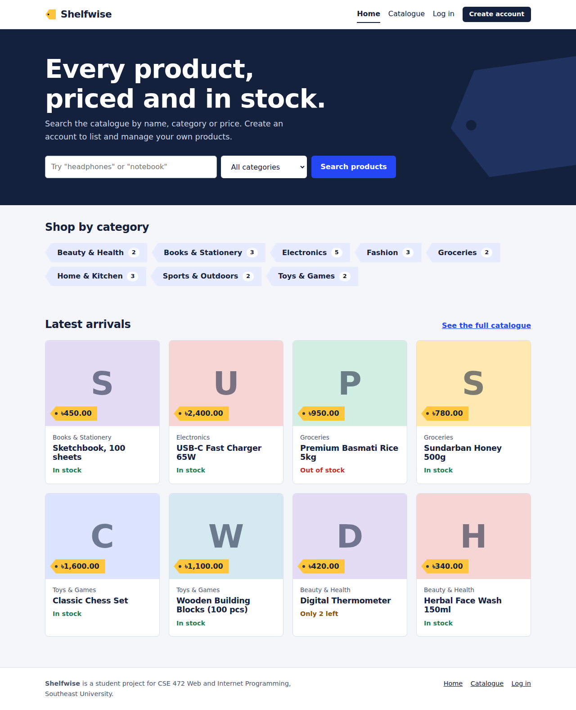
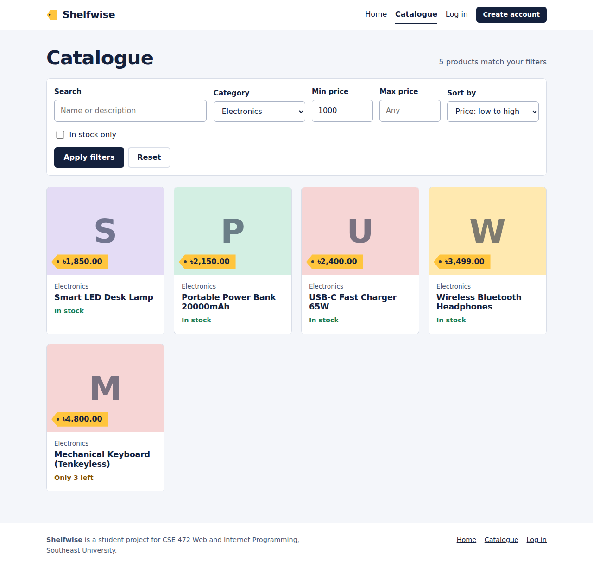
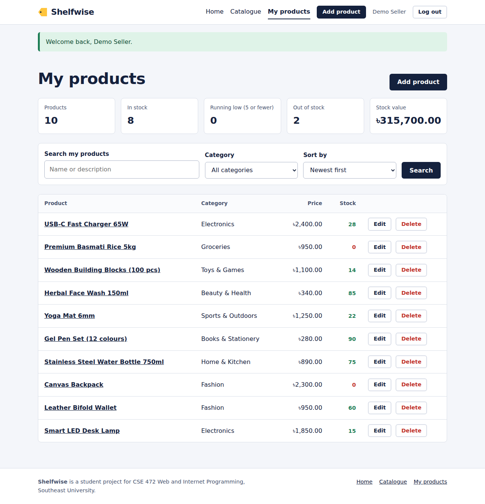
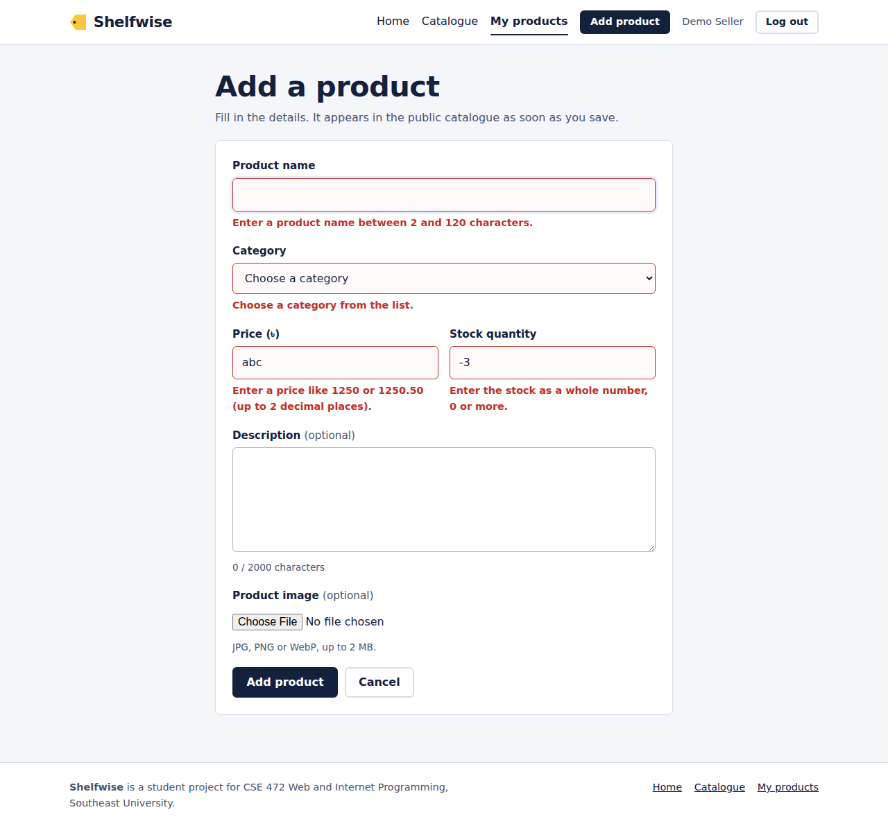
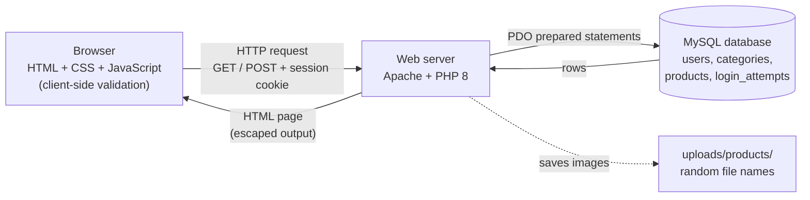
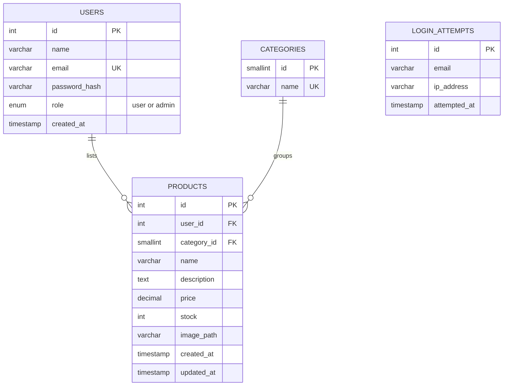

# Shelfwise: Product Catalogue
Live link- https://severus-shelfwise.rf.gd/product-catalogue/
A full-stack product catalogue web application built with **HTML, CSS, JavaScript, PHP and MySQL**.
Visitors can search and filter the public catalogue. Registered users can add, edit and delete their own products.

> **Course:** CSE 472 Web and Internet Programming, Southeast University
> **Assignment:** Individual Project (Full-Stack Mini Web Application)
> **Author:** `YOUR NAME` (`YOUR STUDENT ID`)
> **Live site:** `PASTE YOUR LIVE URL HERE`

## Features

| Area | What it does |
|---|---|
| Pages | Home, Catalogue, Product detail, Register, Log in, Dashboard (My products), Add/Edit product |
| Authentication | Registration, login, logout, `password_hash()` (bcrypt), session-based login, 30-minute idle timeout |
| CRUD | Create, Read, Update, Delete on the **Product** entity, including optional image upload |
| Search and filter | Text search (name and description), category filter, price range, in-stock only, four sort orders, pagination |
| Access control | Guests can browse only. Users manage their own products. An `admin` role can manage every product |
| Validation | Every field is validated in the browser (JavaScript) **and** again on the server (PHP) |
| Security | Prepared statements, output escaping, CSRF tokens, secure image uploads, login throttling, security headers |
| Responsive | Works on phones, tablets and desktops. Keyboard accessible with visible focus states |

## Screenshots

| Home | Catalogue with filters |
|---|---|
|  |  |

| Dashboard (CRUD) | Add product with validation |
|---|---|
|  |  |

## Architecture



## Database schema



`login_attempts` is standalone: it only records failed logins so repeated guessing can be slowed down.

## Project structure

```
├── index.php              Home page
├── catalogue.php          Public catalogue (search / filter / sort / pagination)
├── product.php            Single product page
├── register.php           Create account
├── login.php              Log in
├── logout.php             Log out (POST only)
├── dashboard.php          My products (list + search + stats)
├── product_form.php       Add / edit product (Create + Update)
├── product_delete.php     Delete product (POST only)
├── includes/              PHP logic (not web-accessible)
│   ├── bootstrap.php      config, security headers, session setup
│   ├── db.php             PDO connection
│   ├── auth.php           login, sessions, roles, throttling
│   ├── products.php       queries, validation, image upload
│   ├── helpers.php        escaping, CSRF, flash messages, pagination
│   └── header.php / footer.php / error_view.php
├── assets/css/style.css   Styles
├── assets/js/app.js       Client-side validation and interactivity
├── config/                config.sample.php (copy to config.php)
├── database/              schema.sql and seed_demo.sql
├── uploads/products/      Uploaded product images
└── tests/smoke_test.sh    Automated end-to-end tests
```

## Run it locally (XAMPP)

1. Install [XAMPP](https://www.apachefriends.org/) and start **Apache** and **MySQL**.
2. Copy this folder into `C:\xampp\htdocs\product-catalogue` (or clone the repository there).
3. Open **phpMyAdmin** (`http://localhost/phpmyadmin`), create a database called `catalogue_db` (collation `utf8mb4_unicode_ci`).
4. Select that database, choose **Import**, and import `database/schema.sql`. Then import `database/seed_demo.sql` for demo data (optional).
5. Copy `config/config.sample.php` to `config/config.php` and edit it:
   ```php
   'db'  => ['host' => 'localhost', 'name' => 'catalogue_db', 'user' => 'root', 'pass' => '', 'charset' => 'utf8mb4'],
   'app' => [ ... 'base_url' => '/product-catalogue', 'debug' => true, ... ],
   ```
6. Visit `http://localhost/product-catalogue/`.

Requires **PHP 8.1 or newer** and MySQL 5.7+ / MariaDB 10.3+.

### Demo accounts (only if you imported `seed_demo.sql`)

| Role | Email | Password |
|---|---|---|
| Admin | `admin@shelfwise.test` | `Admin@1234` |
| User | `demo@shelfwise.test` | `Demo@1234` |

> **Delete these two accounts on your live site once you have finished demonstrating**, because the passwords are public in this repository.

## Deploy on InfinityFree (free PHP + MySQL hosting)

1. Create an account at [infinityfree.com](https://www.infinityfree.com/) and create a hosting account with a free subdomain.
2. In the control panel, open **MySQL Databases** and create a database. Note the **host name**, **database name**, **user name** and **password** (InfinityFree shows values such as `sql123.infinityfree.com` and `if0_12345678_catalogue`).
3. Open **phpMyAdmin** for that database and import `database/schema.sql`, then `database/seed_demo.sql` (optional).
4. In the control panel, set the **PHP version** to 8.1 or newer.
5. Using the online **File Manager** or an FTP client such as FileZilla, upload the project files into the `htdocs` folder. Do **not** upload `.git`, `tests/` or `docs/`.
6. On the server, create `htdocs/config/config.php` from `config.sample.php` with the database details from step 2, `base_url` set to `''`, and `debug` set to `false`.
7. Delete any default `index.html` in `htdocs` so `index.php` loads, then open your site URL.

If pages load without styling or scripts after deployment, set `'csp' => false` in `config/config.php` (some hosts inject their own scripts, which a strict Content-Security-Policy blocks).

## Push to GitHub

```bash
git init
git add .
git commit -m "Shelfwise product catalogue"
git branch -M main
git remote add origin https://github.com/YOUR-USERNAME/YOUR-REPO.git
git push -u origin main
```

`config/config.php` and uploaded images are listed in `.gitignore`, so your database password is never published.

## Security measures

| Threat | How it is handled |
|---|---|
| SQL injection | All queries use PDO **prepared statements** with bound parameters (`EMULATE_PREPARES` off). Sort orders come from a whitelist |
| Cross-site scripting (XSS) | Every dynamic value is passed through `htmlspecialchars()` via the `e()` helper. A Content-Security-Policy header blocks inline scripts |
| Cross-site request forgery (CSRF) | Every form has a random session token, verified with `hash_equals()`. Logout and delete are POST-only. Session cookie uses `SameSite=Lax` |
| Weak password storage | `password_hash()` / `password_verify()` (bcrypt), with automatic rehash when the algorithm improves |
| Session attacks | `HttpOnly` and `Secure` (on HTTPS) cookie, strict mode, session id regenerated at login, destroyed at logout, 30-minute idle timeout |
| Brute-force login | 5 failed attempts per account and IP (20 per IP) locks logins for 15 minutes. Errors never reveal whether an email exists |
| Broken access control | Ownership is checked on the server before showing, saving or deleting a product. Guests are redirected to login |
| Open redirect | The `?next=` parameter accepts only a short whitelist of internal page names |
| Malicious uploads | File contents are inspected (not the filename), only JPG/PNG/WebP up to 2 MB, saved under a random name, script execution blocked in `uploads/` |
| Information leakage | Errors are logged, not shown, unless `debug` is on. Sensitive folders are protected by `.htaccess` |

## Testing

`tests/smoke_test.sh` runs 75+ automated checks (search, filters, validation, CRUD, access control, CSRF, XSS, SQL injection, file upload, cookie flags).
It **resets the test database**, so only run it against a local development database:

```bash
php -S 127.0.0.1:8000 -t .      # terminal 1
bash tests/smoke_test.sh        # terminal 2
```

## Credits and references

- Fonts: Bricolage Grotesque and Instrument Sans (Google Fonts, SIL Open Font License).
- Security guidance: OWASP Cheat Sheet Series (SQL Injection Prevention, CSRF Prevention, Session Management, File Upload).
- PHP manual for `password_hash`, PDO and `getimagesize`.

All application code was written for this assignment. Add any additional sources you used here.
